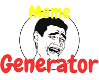
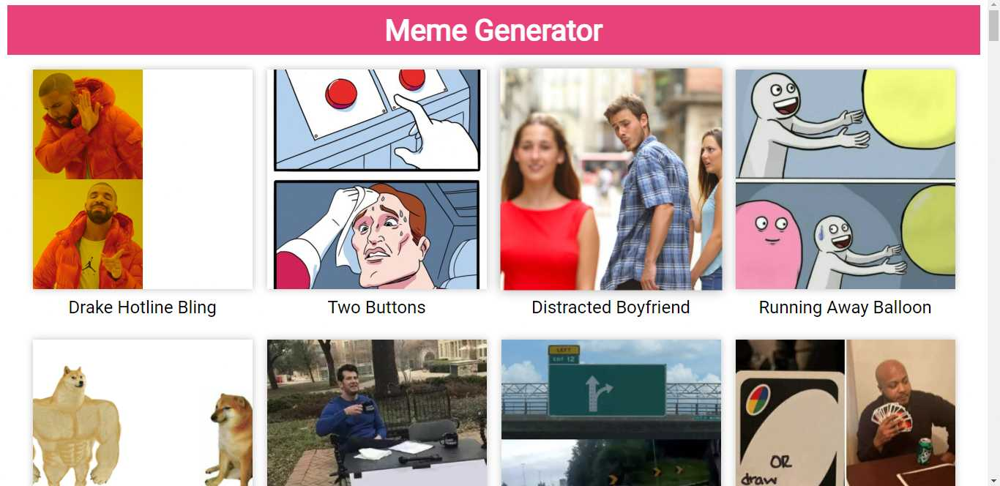
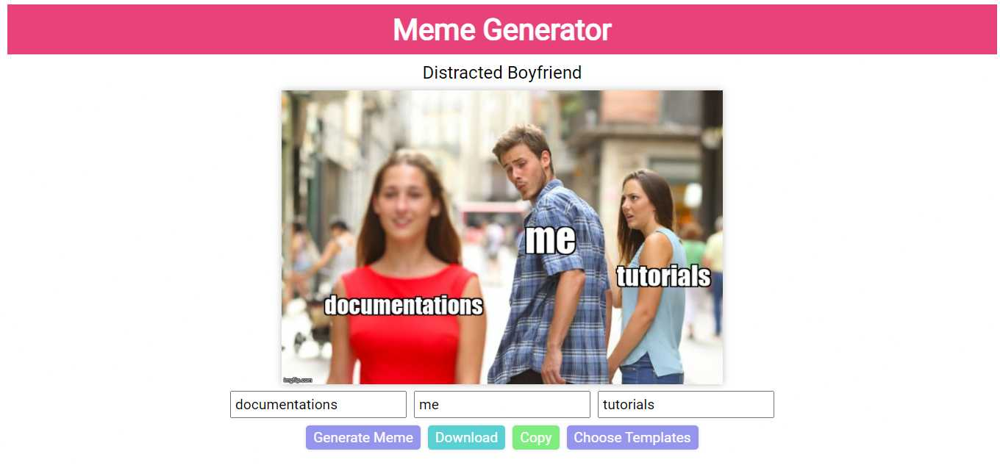

<!-- PROJECT SHIELDS -->
<!--
*** I'm using markdown "reference style" links for readability.
*** Reference links are enclosed in brackets [ ] instead of parentheses ( ).
*** See the bottom of this document for the declaration of the reference variables
*** for contributors-url, forks-url, etc. This is an optional, concise syntax you may use.
*** https://www.markdownguide.org/basic-syntax/#reference-style-links
-->
[![Contributors][contributors-shield]][contributors-url]
[![Forks][forks-shield]][forks-url]
[![Stargazers][stars-shield]][stars-url]
[![Issues][issues-shield]][issues-url]
[![MIT License][license-shield]][license-url]
[![LinkedIn][linkedin-shield]][linkedin-url]

<!-- PROJECT LOGO -->
 

  

    <h3 align="center">Best-README-Template</h3>
  

    A Meme Generator. Bring Your Meme in Life.
     
    <a href="https://github.com/Bivas-Biswas/meme-generator"><strong>Explore the docs »</strong></a>
     
     
    <a href="https://bivas-biswas.github.io/meme-generator/">View Demo</a>
    ·
    <a href="https://github.com/Bivas-Biswas/meme-generator/issues">Report Bug</a>
    ·
    <a href="https://github.com/Bivas-Biswas/meme-generator/issues">Request Feature</a>
  

<!-- TABLE OF CONTENTS -->
# Table of Contents

- [Contents](#table-of-contents)
  - [About The Project](#about-the-project)
    - [Showcase](#showcase)
    - [Built With](#built-with)
    - [Extra Features](#extra-features)
  - [Contributing](#contributing)
  - [License](#license)
  - [Acknowledgements](#acknowledgements)
  

<!-- ABOUT THE PROJECT -->
## About The Project
Meme Generator is a most popular poject test our knowledge. So I also creating a meme generator. Help of the 
[Imgflip API](https://imgflip.com/api).

### Showcase
<table align="center">
    <tr>
        <td>
            <a href="https://bivas-biswas.github.io/meme-generator">
                

                    
                    
Home Page

                

            </a>
        </td>
    </tr>
    <tr>
        <td>
            <a href="https://bivas-biswas.github.io/BrickBreakers">
                

                    
                    
Setting Page

                

            </a>
        </td>
    </tr>
</table>

### Built With

### Extra Features
* download button
* copy button
* mobile responsive

## Contributing

[![Contributors][contributors-shield]][contributors-url]

Contributions are what make the open source community such an amazing place to learn, inspire, and create. Any contributions you make are **greatly appreciated**.

1. Fork the Project
2. Create your Feature Branch (`git checkout -b feature/AmazingFeature`)
3. Commit your Changes (`git commit -m 'Add some AmazingFeature'`)
4. Push to the Branch (`git push origin feature/AmazingFeature`)
5. Open a Pull Request

<!-- LICENSE -->

## License

[![MIT License][license-shield]][license-url]

## Acknowledgements
  
- API Provider - [Image Flip](https://imgflip.com/api)
- library for save file - [file-saver](https://github.com/eligrey/FileSaver.js/)
- library for copy file - [copy-image-clipboard](https://github.com/LuanEdCosta/copy-image-clipboard)
- [Choose an Open Source License](https://choosealicense.com)
- [GitHub Pages](https://pages.github.com)
- [GitHub Socialify](https://socialify.git.ci/)
- [Img Shields](https://shields.io)

<!-- MARKDOWN LINKS & IMAGES -->
<!-- https://www.markdownguide.org/basic-syntax/#reference-style-links -->
[contributors-shield]: https://img.shields.io/github/contributors/Bivas-Biswas/meme-generator.svg?style=for-the-badge
[contributors-url]: https://github.com/Bivas-Biswas/meme-generator/graphs/contributors
[forks-shield]: https://img.shields.io/github/forks/Bivas-Biswas/meme-generator.svg?style=for-the-badge
[forks-url]: https://github.com/Bivas-Biswas/meme-generator/network/members
[stars-shield]: https://img.shields.io/github/stars/Bivas-Biswas/meme-generator.svg?style=for-the-badge
[stars-url]: https://github.com/Bivas-Biswas/meme-generator/stargazers
[issues-shield]: https://img.shields.io/github/issues/Bivas-Biswas/meme-generator.svg?style=for-the-badge
[issues-url]: https://github.com/Bivas-Biswas/meme-generator/issues
[license-shield]: https://img.shields.io/github/license/Bivas-Biswas/meme-generator.svg?style=for-the-badge
[license-url]: https://github.com/Bivas-Biswas/meme-generator/blob/master/LICENSE.txt
[linkedin-shield]: https://img.shields.io/badge/-LinkedIn-black.svg?style=for-the-badge&logo=linkedin&colorB=555
[linkedin-url]: https://www.linkedin.com/in/bivas-biswas-828a731b7/